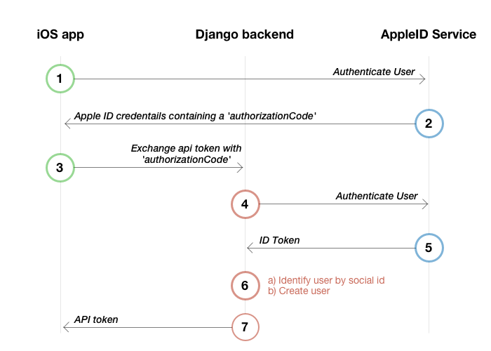

# Implement Sign In with Apple in your Django (Python) backend

_Requirements: Python 3, Django 2_


### Intro

Apple adopted the existing standards **OAuth 2.0** and **OpenID Connect** to use as the foundation for their new API. If you're familiar with these technologies, you can easily start Sign In with Apple right away!

In this article we'll be using **Python Social Auth**. It has OAuth 2.0 and OpenID support built in. On top of that we'll build a custom backend that will help. We just have to override some functionality and we're good to go.


### How it works

In the diagram you can see the whole authentication flow covering all steps.  
Steps 1-3 begin with how to [Implement Sign In with Apple on iOS](iOS.md).




### Generate the key

Before we can start diving into code you'll need to [generate a key](identifiers-and-keys.md#create-a-sign-in-with-apple-key-for-your-backend) on Apple's Developer Portal in order for Apple to associate and verify your requests.


### Authentication request to the Apple ID service

Once the iOS app calls the backend providing a `authorizationCode`, we can build our authentication request. It consists of a few pieces:

- **Key ID** (The ID of the key you've generated on Apple's Developer Portal)
- **Apple Developer Team ID**
- **Client ID** (The iOS app's bundle ID, e.g. `com.yourcompany.yourapp`)
- **Client Secret**


### Create the client secret

Rather than static client secrets, Apple requires you to derive a client secret from your private key every time. We need the `ES256` JWT algorithm to generate it. There are already some libraries to do this for you. In this example we use `PyJwt`.

```shell
pip install pyjwt
```

```python
import jwt

headers = {
   'kid': settings.SOCIAL_AUTH_APPLE_KEY_ID
}

payload = {
   'iss': settings.SOCIAL_AUTH_APPLE_TEAM_ID,
   'iat': timezone.now(),
   'exp': timezone.now() + timedelta(days=180),
   'aud': 'https://appleid.apple.com',
   'sub': settings.CLIENT_ID,
}

client_secret = jwt.encode(
   payload, 
   settings.SOCIAL_AUTH_APPLE_PRIVATE_KEY, 
   algorithm='ES256', 
   headers=headers
).decode("utf-8")
```

This is also described in Apple's documentation [Creating the Client Secret](https://developer.apple.com/documentation/signinwithapplerestapi/generate_and_validate_tokens).


### Implement a custom backend

Now that you have the client secret generation ready, you can start with the custom backend. Python Social Auth implements OAuth 2.0 standards but Apple has some differences in their flow. In order to complete Sign In with Apple you have to extend `BaseOAuth2` and customize or override some functions.

- `get_key_and_secret` override this as you have to generate the client secret the way mentioned above
- `get_user_details` override just to give back the email address or other user information to the Python Social Auth framework
- `do_auth` override do_auth method as you need to verify the code or access token given by the iOS client from Apple and get the ID token from which other details can be extracted.


### What is so important about the ID Token?

With the response of the validate token call Apple returns an `id_token` that contains bunch of information. Two things are very important: `sub` (subject) is the unique user id and `email` is the email address of the user, fake or real.

You can decode the token by using JWT:

```python
decoded = jwt.decode(id_token, '', verify=False)
```

This is described in Apple's documentation [Generate and Validate Tokens](https://developer.apple.com/documentation/signinwithapplerestapi/generate_and_validate_tokens).

We have created a `AppleOAuth2` class as a custom backend for Sign In with Apple using Python Social Auth.

```python
import jwt
import requests
from datetime import timedelta
from django.conf import settings
from django.utils import timezone
from social_core.backends.oauth import BaseOAuth2
from social_core.utils import handle_http_errors


class AppleOAuth2(BaseOAuth2):
    """apple authentication backend"""

    name = 'apple'
    ACCESS_TOKEN_URL = 'https://appleid.apple.com/auth/token'
    SCOPE_SEPARATOR = ','
    ID_KEY = 'uid'

    @handle_http_errors
    def do_auth(self, access_token, *args, **kwargs):
        """
        Finish the auth process once the access_token was retrieved
        Get the email from ID token received from apple
        """
        response_data = {}
        client_id, client_secret = self.get_key_and_secret()

        headers = {'content-type': "application/x-www-form-urlencoded"}
        data = {
            'client_id': client_id,
            'client_secret': client_secret,
            'code': access_token,
            'grant_type': 'authorization_code',
        }

        res = requests.post(AppleOAuth2.ACCESS_TOKEN_URL, data=data, headers=headers)
        response_dict = res.json()
        id_token = response_dict.get('id_token', None)

        if id_token:
            decoded = jwt.decode(id_token, '', verify=False)
            response_data.update({'email': decoded['email']}) if 'email' in decoded else None
            response_data.update({'uid': decoded['sub']}) if 'sub' in decoded else None

        response = kwargs.get('response') or {}
        response.update(response_data)
        response.update({'access_token': access_token}) if 'access_token' not in response else None

        kwargs.update({'response': response, 'backend': self})
        return self.strategy.authenticate(*args, **kwargs)

    def get_user_details(self, response):
        email = response.get('email', None)
        details = {
            'email': email,
        }
        return details

    def get_key_and_secret(self):
        headers = {
            'kid': settings.SOCIAL_AUTH_APPLE_KEY_ID
        }

        payload = {
            'iss': settings.SOCIAL_AUTH_APPLE_TEAM_ID,
            'iat': timezone.now(),
            'exp': timezone.now() + timedelta(days=180),
            'aud': 'https://appleid.apple.com',
            'sub': settings.CLIENT_ID,
        }

        client_secret = jwt.encode(
            payload, 
            settings.SOCIAL_AUTH_APPLE_PRIVATE_KEY, 
            algorithm='ES256', 
            headers=headers
        ).decode("utf-8")
        
        return settings.CLIENT_ID, client_secret
```

A very important thing to know is, that the email address and the name are returned only the first time you make the request. So, if you need to test this over and over again, you need to remove your app from the authorised apps of your [AppleID account](https://appleid.apple.com) everytime.


### Not using Python Social Auth?

If you are not using Python Social Auth, you can do the manual creation of the user after the validation and decoding of id_token you got from Apple. In case the uid already exists, then that's the same user, you just have to login. In our case Python Social Auth is doing this already :)
