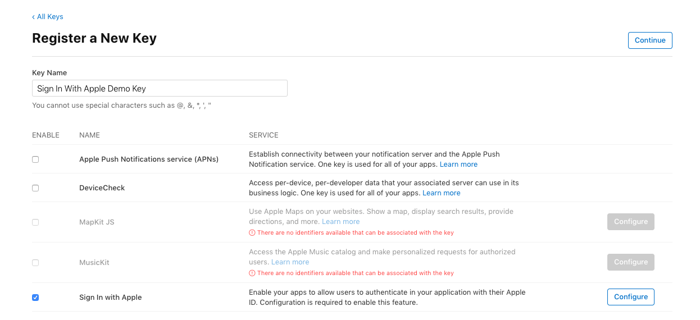
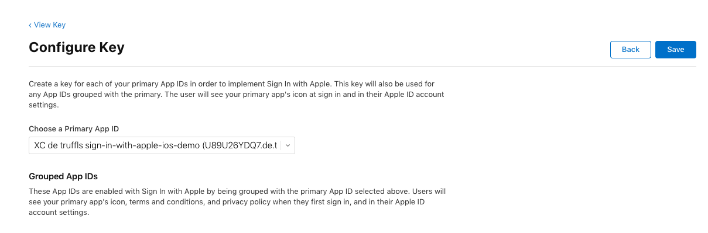
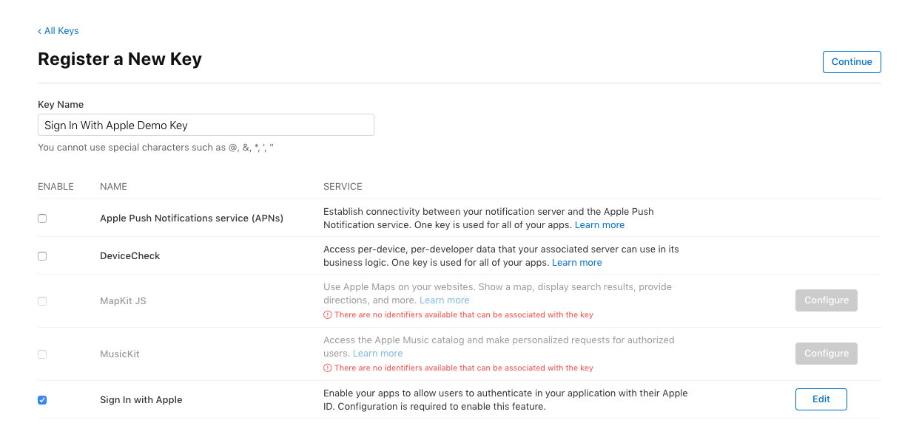
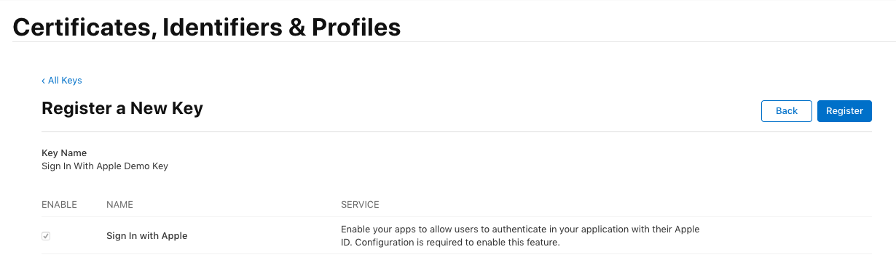
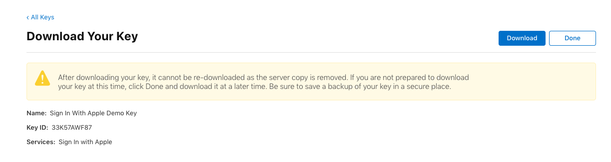
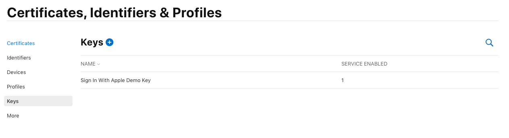
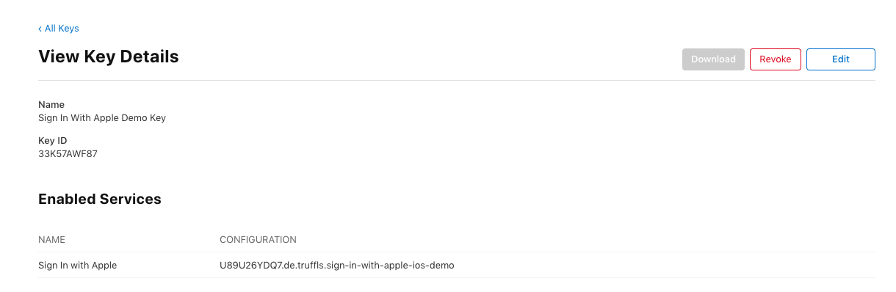

# Identifiers and Keys on Apple's Developer Portal

## Add Sign In with Apple to your app's capabilities

1. Go to Xcode's project navigator
2. Select your Xcode project
3. Select your target
4. Go to the _Signing & Capabilities_ tab
5. Click the _+ Capability_ button
6. Select _Sign In with Apple_

### A) Automatic Signing

Done. Xcode will add it to the entitlements, sync the capabilities to the Developer Portal and generate new provisioning profiles for you.

### B) Manual Signing

#### Add Sign In With Apple to the app ID

7. Go to the Developer Portal and select _Identifiers_.
8. Select your app your want to add Sign In with Apple to.
9. Scroll down to Sign In with Apple and tick the checkbox.
10. Click Save

By default this app ID is enabled to be the primary app ID.  
Optionally: If you're using multiple apps or web authentication you might want to assign them to this app ID as a group.

#### Re-generate provision profiles

Changing the app ID invalidates the provisioning profiles associated with it, so we need to generate them again.

11. Go to _Profiles_.
12. Click on each profile associated with this app ID and just save it again.
13. Either download it from the portal manually or through Xcode.

Now you can continue with the [iOS implementation](iOS.md#1-add-the-authenticationservices-framework).

## Create a key for your backend

### Go to "Keys" and click "Create a key"

### Give it a name and tick the Sign In with Apple checkbox

### Click "Configure", select you app ID, and click "Save"

### Click "Continue"

### Click "Register" to generate the key

### Download the key file by clicking "Download"

### Finish by clicking "Done"

### Click on the key to see the key ID again

### Use the key in your backend

Now you can continue with the [backend implementation](backend.md).
